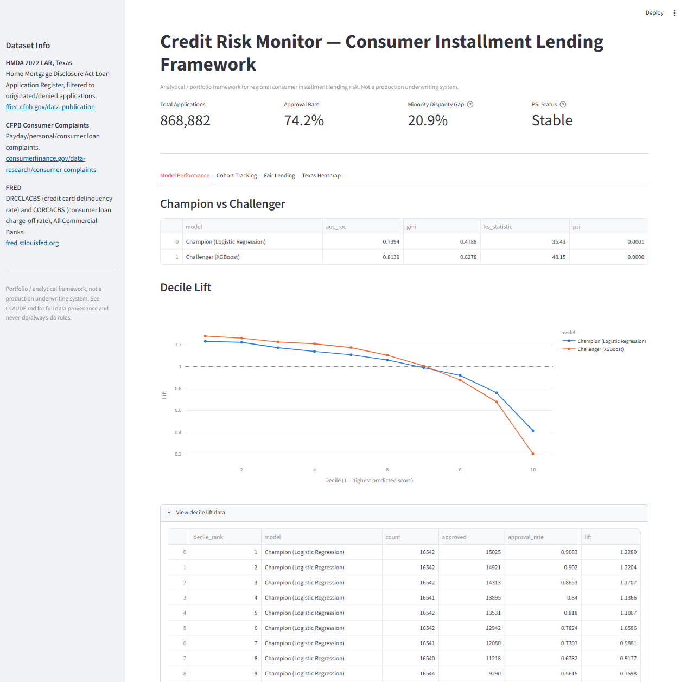
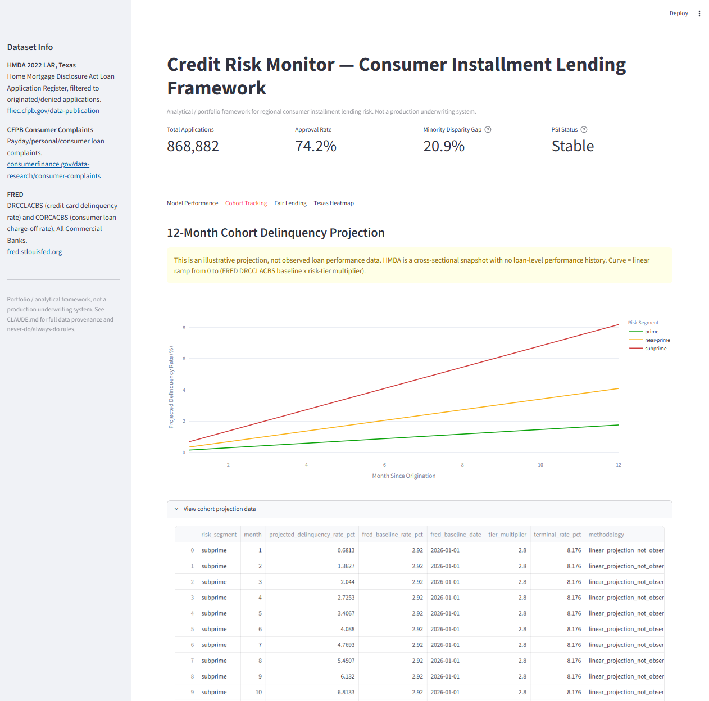
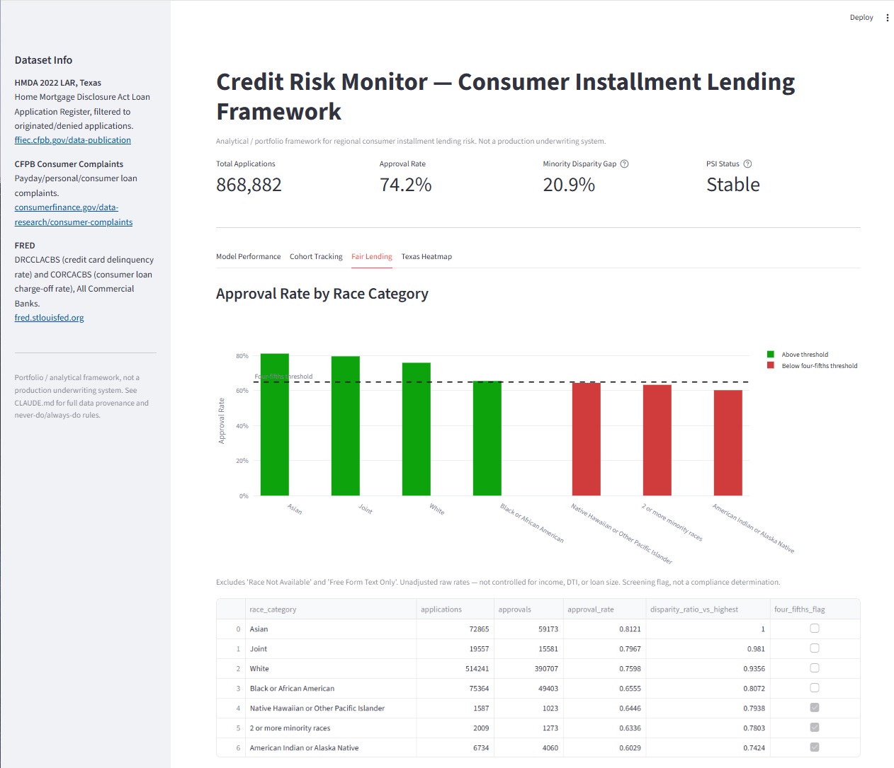
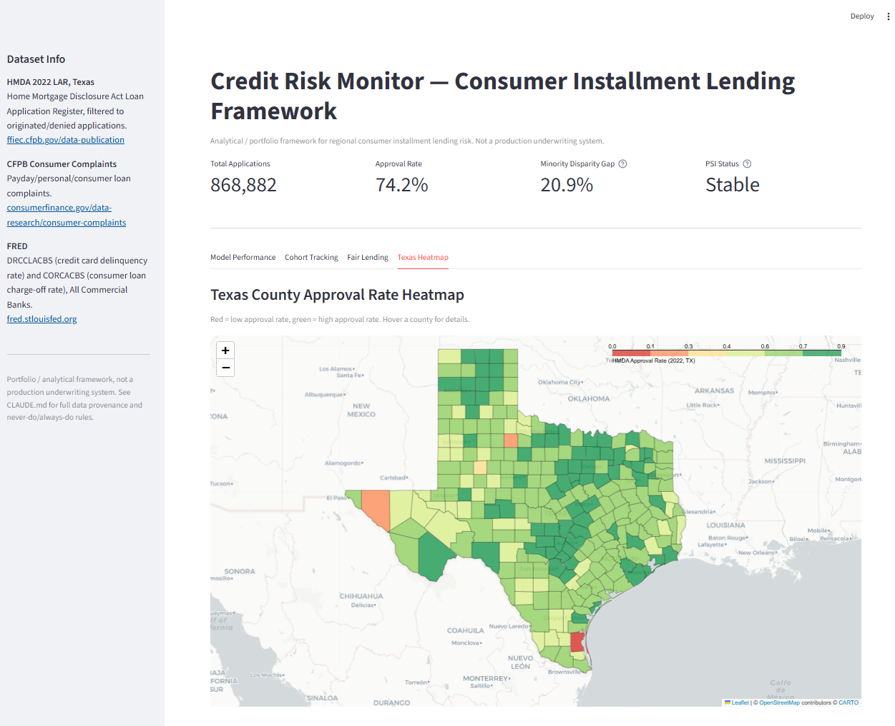

# Credit Risk Monitor

A credit risk monitoring framework for consumer installment lenders operating at
the Regional Finance tier (mid-size, near-prime/subprime consumer lenders). It
combines public mortgage-lending data (HMDA) and consumer complaint data (CFPB),
enriched with FRED macroeconomic indicators, into a risk segmentation and
champion/challenger modeling pipeline, a fair-lending parity screen, a
population-stability drift monitor, and an interactive Texas county heatmap —
all surfaced in a Streamlit dashboard.

**This is a portfolio/analytical project, not a production underwriting
system.** Nothing here should be used, or presented, as an actual credit
decisioning tool. See [CLAUDE.md](CLAUDE.md) for full data provenance and
project rules.

## Dataset Sources

| Dataset | Description | Source |
|---|---|---|
| HMDA 2022 LAR (Texas) | Home Mortgage Disclosure Act Loan Application Register, filtered to Texas, originated/denied applications | [ffiec.cfpb.gov/data-publication](https://ffiec.cfpb.gov/data-publication/) |
| CFPB Consumer Complaints | Payday/personal/consumer installment loan complaints | [consumerfinance.gov/data-research/consumer-complaints](https://www.consumerfinance.gov/data-research/consumer-complaints/) |
| FRED (DRCCLACBS, CORCACBS) | Delinquency rate on credit card loans / charge-off rate on consumer loans, all commercial banks | [fred.stlouisfed.org](https://fred.stlouisfed.org/) |
| TX county boundaries | Census-derived, FIPS-keyed county GeoJSON, used for the choropleth map | [plotly/datasets](https://github.com/plotly/datasets) |

HMDA covers mortgage lending, not installment/payday loans — it's used here as
a regional proxy for underwriting and fair-lending patterns in Texas, not as
direct data on any specific lender's own loan book.

## Folder Structure

```
credit-risk-monitor/
├── data/
│   ├── raw/            # Original source CSVs + cached TX county GeoJSON
│   └── processed/      # Cleaned/engineered datasets (gitignored, regenerable)
├── src/
│   ├── data_loader.py  # Load + clean HMDA and CFPB raw data
│   ├── fred_loader.py  # Pull FRED macro series
│   ├── features.py     # Risk segmentation and fair-lending feature engineering
│   ├── models.py       # Champion (Logistic Regression) / challenger (XGBoost) pipeline
│   ├── monitor.py      # PSI drift monitoring + cohort delinquency projection
│   ├── fair_lending.py # Four-fifths rule disparity screening
│   └── choropleth.py   # Interactive Texas county approval-rate heatmap
├── models/              # Trained model artifacts (gitignored)
├── dashboard/
│   └── app.py           # Streamlit dashboard
├── notebooks/            # Exploratory analysis
├── tests/
├── outputs/              # Generated charts, reports, evaluation CSVs (gitignored)
├── .env.example          # FRED_API_KEY template
├── requirements.txt
└── CLAUDE.md              # Full project context and rules
```

## Setup

```bash
git clone https://github.com/Rohanrsp14/Credit-Risk-Monitor.git
cd Credit-Risk-Monitor

python -m venv venv
venv\Scripts\activate        # Windows
# source venv/bin/activate   # macOS/Linux

pip install -r requirements.txt

cp .env.example .env         # then fill in your FRED_API_KEY
```

Place the raw source CSVs in `data/raw/` (`hmda_2022_tx.csv`,
`cfpb_complaints.csv` — not included in the repo; download from the sources
above), then run the pipeline in order:

```bash
python src/data_loader.py
python src/fred_loader.py
python src/features.py
python src/models.py
python src/monitor.py
python src/fair_lending.py
python src/choropleth.py
```

Then launch the dashboard:

```bash
streamlit run dashboard/app.py
```

## Dashboard

### Model Performance


### Cohort Tracking


### Fair Lending


### Texas Heatmap


## Regulatory Framework Context

This project borrows concepts from real bank model-risk and fair-lending
practice to give the framework realistic structure — it does not implement or
certify compliance with any of the following:

- **SR 11-7** (Federal Reserve / OCC Supervisory Guidance on Model Risk
  Management) — motivates the champion/challenger structure, independent
  evaluation metrics (AUC, Gini, KS), and PSI-based ongoing monitoring in
  `src/models.py` and `src/monitor.py`. A real SR 11-7 program requires
  independent validation, documented conceptual soundness review, and
  effective challenge — none of which this project provides.
- **ECOA / Regulation B** (Equal Credit Opportunity Act) — motivates the
  four-fifths disparity screen in `src/fair_lending.py`. Note that
  `src/models.py` includes an `is_minority` feature in the model per this
  project's own build spec; using protected-class status as a decisioning
  input would violate ECOA/Reg B in a real underwriting system. This is only
  present here as an analytical/portfolio exercise.
- **CFPB** (Consumer Financial Protection Bureau) — both the HMDA and
  complaints datasets are sourced from the CFPB, which also supervises fair
  lending and UDAAP compliance for consumer lenders at this tier.

## Never-Do / Always-Do Rules

See [CLAUDE.md](CLAUDE.md) for the full list — most importantly: no synthetic
data, no hardcoded secrets, no overclaiming model accuracy, and every output
must cite its data source.
